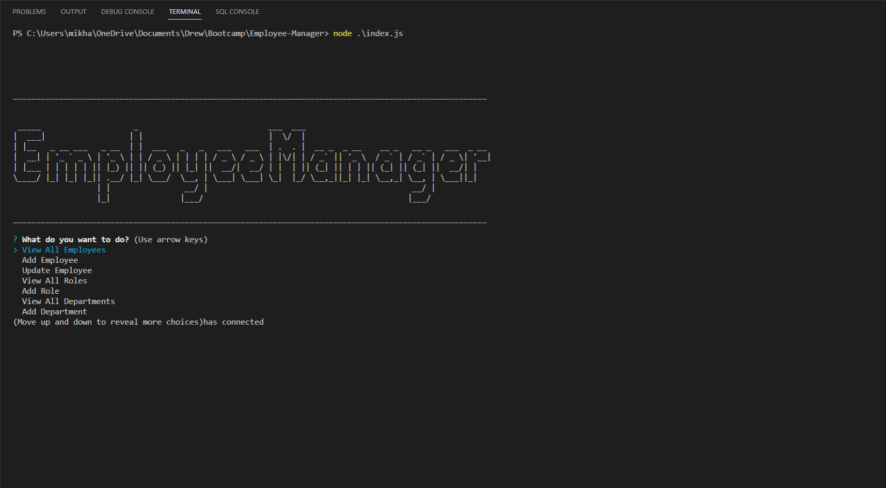

# Employee-Manager

This is an Command-line app on the back-end, that allows you to add and view employees, departments and roles. The app uses node.js, MySQL, with inquirer.

## Table of Contents

- [Video](#Video)
- [Install](#Install)
- [Screenshots](#Screenshots)
- [Technologies Used](#TechnologiesUsed)
- [Questions / Contact](#Questions)

# Video

If you are having trouble running I have provided a video that contains a Demo below

[Demo Video](https://watch.screencastify.com/v/jIgdd7A4YOXaSCgn92sp)

# Install

_You will need MySQL and Node.js installed for this to work_

[Click Here](https://github.com/Drewpayton/Employee-Manager) to access the github repo

After you clone the repo you'll open the terminal and run the following:

`npm i`

The line above will install all your dependencies, next you will log into your MySQL from the terminal and use the two lines below:

`SOURCE db/schema.sql` and then `SOURCE db/seeds.sql`

After you run those you can start the program with the following command:

`node index.js`

# Screenshots

# Technologies Used

I used Node.js, Inquirer, mysql2, MySQL

# Questions

If there are any issues feel free to contact me at [drewpayton18@gmail.com](drewpayton18@gmail.com)

My contacts/pages:

- [Github](https://github.com/Drewpayton)
- [LinkedIn](https://www.linkedin.com/in/drewpayton2018/)
- [Portfolio](https://drewpayton.github.io/personal-portfolio/)
